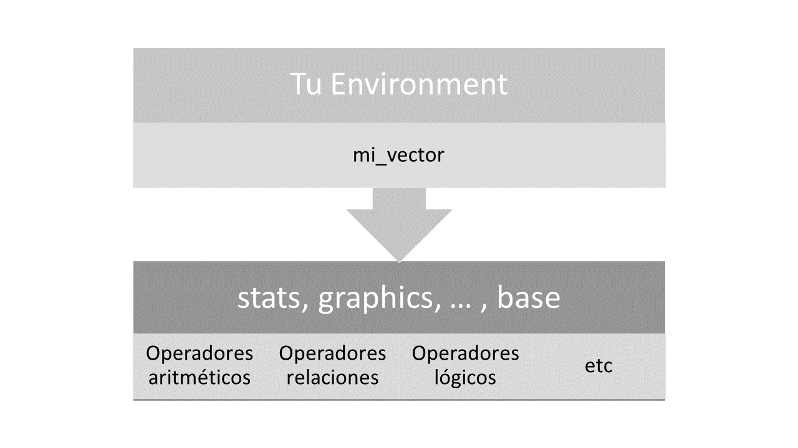
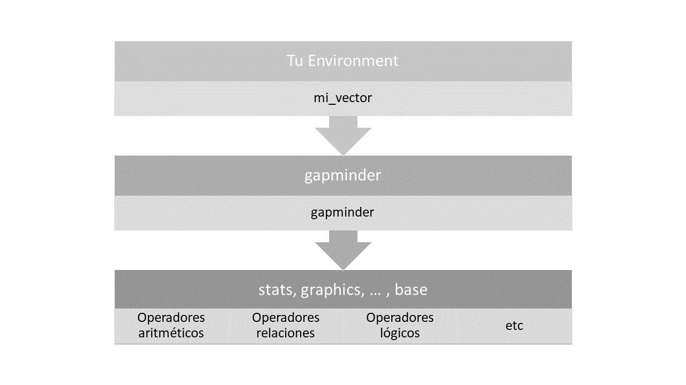
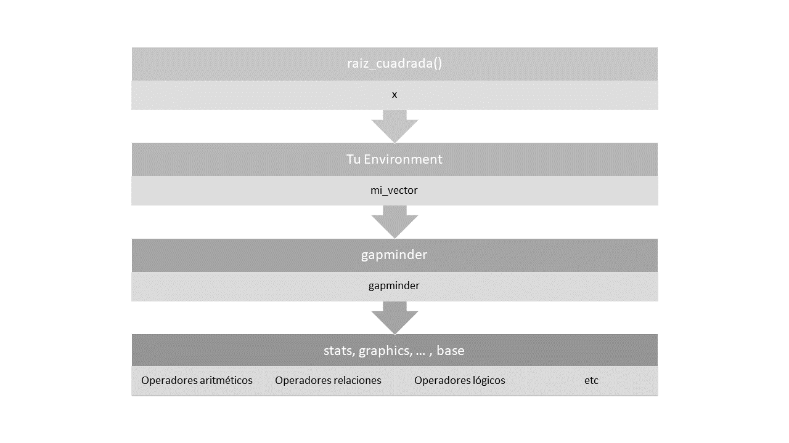

```{r setup, include=FALSE}
knitr::opts_chunk$set(echo = TRUE)
```


## Crear nuevo proyecto

Para que mantengas un buen orden en tu aprendizaje, es momento de crear un nuevo proyecto en el que irás anotando todo lo que aprendas en esta sesión. Cabe mencionar que todo lo que anotes deberás publicarlo al final en tu perfil de Rpubs.com

- Crear un nuevo proyecto en nuevo directorio: "04-ejercicios"

## Instala el paquete de ejercicios

Puedes instalar la versión más reciente de `ejerciciosT2` desde el r-universe de *talleresdedatos* con:

```r
install.packages("ejerciciosT2", repos = 'https://talleresdedatos.r-universe.dev')
```

O desde el repositorio en Github con:

```r
remotes::install_github("talleresdedatos/ejerciciosT2")
```

## Créditos

Buena parte de lo que se verá hoy es una adaptación breve de los capítulos "Environments" y "Control flow" del libro [Advanved R](https://adv-r.hadley.nz/) de Hadley Wickham.

Recomiendo su lectura. Personalmente, fue el libro que me hizo enamorarme de R y entender todo lo que no entendía tan solo con la práctica diaria.

Quiero decir explícitamente que los ejemplos y expresiones usadas para ilustrar esta sesión, no son 100% correctos técnicamente, sin embargo están diseñados para aportar claridad a la explicación.

# Environments

## Objetos básicos de R

Hasta el momento hemos ido conociendo algunos objetos con los que se trabajan típicamente en R. Por mencionar algunos:

- Operador: Es un símbolo que nos permite realizar operaciones dentro de nuestra sesión. En su forma básica, permite realizar operaciones aritméticas, relacionales y lógicas.
- Vector: La estructura básica de almacenamiento de datos en R. En su forma básica, pueden contener valores de tipo lógico (logical), numérico (integer y double) y de texto (character).
- Dataframe: Es la manera en que R almacena datos tabulares. Dentro de ellos, cada fila puede corresponder a una observación y cada columna a una variable. Se forma a partir de vectores.
- Función: Es la manera en que R almacena la lógica de una operación para obtener un *output*. Puede contener argumentos, que sirven como *input* en la operación definida. Es posible utilizar funciones dentro de otras funciones.


## Scoping

Cada vez que referenciamos el nombre de un objeto en una operación, debemos tomar en cuenta el contexto en el que se va a ejecutar esa operación. El contexto es lo que conocemos como "Environment". 

En RStudio tienes un panel en el que puedes inspeccionar el contenido de tu Environment. Por defecto, este panel muestra el contenido de los valores que vas creando dentro de tu sesión de R.

Por ejemplo, si creas el siguiente  vector:

```{r}
mi_vector <- 1:100
```

El panel Environment te mostrará un objeto llamado "mi_vector" y te dará una vista previa de su contenido. Así, cada vez que creas un objeto en tu sesión, se va añadiendo o sobreescribiendo como objeto en tu panel Environment.

---

Cuando realizas una operación referenciando un objeto, R necesita encontrar el objeto que estás referenciando. Por ejemplo, para calcular la suma de los elementos de `mi_vector`:

```{r}
sum(mi_vector)
```

R busca el objeto `mi_vector` en tu Environment. Si no lo encuentra, te avisará arrojando un error. Por ejemplo, si nos equivocamos al escribir `mi_vector`:

```{r, error=TRUE}
sum(MI_VECTOR)
```

Nos avisa que no ha encontrado el objeto que le hemos pedido.

---

En este estado, podemos pensar en R haciendo la siguiente búsqueda. Primero, en tu Environment, y luego en los paquetes "de inicio". Si no encuentra el objeto en en esta búsqueda arroja un error.

{width=100%}

---

Algo similar ocurre cuando queremos usar un objeto (data o funciones) de un paquete que tenemos instalado. A menos que lo hayamos cargado, R no será capaz de encontrarlo. Por ejemplo, si queremos usar la data `gapminder`.

```{r, error=TRUE}
gapminder
```

Es necesario que antes hayamos cargado el paquete que la contiene.

```{r}
library(gapminder)
gapminder
```

---

Una vez que cargaste el paquete `gapminder`, R realiza una búsqueda de la siguiente manera:

{width=100%}

---

Como habrás notado, el environment que ves en tu panel de Rstudio es siempre el primer lugar en el que R buscará. Si no lo encuentra allí, acude a los paquetes que hayas llamado con `library()`.

## Scoping en funciones

Pongamos como ejemplo la función `raiz_cuadrada()`.

```{r}
raiz_cuadrada <- function(x) {
    x ** (1/2)
}
```

Vemos que hace uso del argumento `x` dentro de sus operaciones. ¿Qué pasa si queremos operador con `x` sin usar `raiz_cuadrada()`?

```{r, error=TRUE}
x + 1
```

R nos avisa que no pudo encontrar a `x`. ¿Por qué sucede?

---

Cuando creamos una función, estamos creando un Environment *artificial*, donde los argumentos usados hacen las veces de objetos almacenados en ese Environment. En el caso anterior, R no puede encontrar `x` porque no está definido en ingún Environment.

Lo mismo sucede si llamamos a la función sin especificar el valor de `x`.

```{r, error=TRUE}
raiz_cuadrada()
```

---

Sin embargo, una vez que se especifica ese valor, la función opera sin problemas.

```{r}
raiz_cuadrada(x = 400)
```

---

La búsqueda que hace R al usar la función `raiz_cuadrada()` (en esta sesión de R) puede interpretarse de la siguiente manera:

{width=100%}


# Ejercicios

## Ejercicio 1

Trata de predecir el resultado del siguiente bloque de código:

```{r, eval=FALSE}
mi_valor <- 10

foo <- function() {
    mi_valor <- 100
    mi_valor
}

mi_valor
```

## Ejercicio 2

Trata de predecir el resultado del siguiente bloque de código:

```{r, eval=FALSE}
mi_valor <- 50

foo <- function(mi_valor = 20) {
    mi_valor <- 100
    mi_valor
}

mi_valor
```

## Ejercicio 3

Trata de predecir el resultado del siguiente bloque de código:

```{r, eval=FALSE}
mi_valor <- 5

foo <- function(mi_valor = 10) {
    mi_valor <- 20
    mi_valor
}

foo()
```
